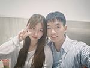
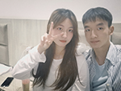
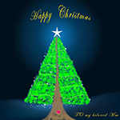

<html>
    <head>
        <meta charset="utf-8" />
        <title>
            Meimei and Zhuang's Happy Life
        </title>
        
    </head>
    <body>
        <h1>
            梅梅是大笨蛋！
        </h1>
        

            This website is build to document Meimei
            and zhuang's life. Record our life, and leave
            affectings. Someday when we are old, we can view 
            this website, and review our past days, that must
            be really interesting. The most thing is, I love 
            you, Meimei.
        

        <h2>
            Our first photo together
        </h2>
        

            
            
        

        

            You're on the left, I'm on the right. 
            The first picture, not very intimate.
        

        

            This is our first photo shoot. It was the National Day.
            I was embarrassed to get too 
            close to you. I looked goofy then, but Meimei always looked beautiful.
        

        <h2>
            Our Chirsmas Gifts
        </h2>
        

            
            
        

        

            
        

        

            On Chirsmas, we drew Chirsmas trees for each other. 
            And there is also a 3D music album to Meimei.
        

    </body>
</html>
